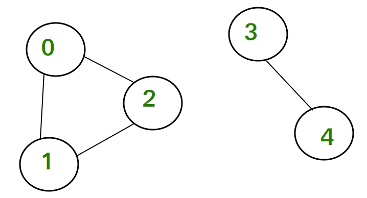

# Minimum Spanning Tree

For any connected undirected graph, the spanning tree is a subgraph where each component is connected. For a graph G = V,E a spanning tree has V-1 edges. Any tree will have V-1 edges.

If a graph is weighted, then each spanning tree will have different cost. MST means the spanning tree with minimum cost

2 Algorithms, both greedy
* Prims Algorithm
* Kruskals Algorithm (prerequisite: [Disjoint Set Union](/dsu.md))

## Prims Algorithm
- Pick a random source vertex
- Mark it as visited
- Push all of its edges into a minheap
- While items in minheap, pop the min cost edge, if the destination vertex not already visited, mark it as visited. Also push all of its edges into the heap. Oh, also please check if the destination of those edges are visited or not (i know you are already lost. you can curse [prim](https://en.wikipedia.org/wiki/Robert_C._Prim))


```python
class Solution:
    def minimumCost(self, n: int, connections: List[List[int]]) -> int:
        # Build the adj list
        adj_list = defaultdict(list)
        for x, y, cost in connections:
            adj_list[x].append((cost, y))
            adj_list[y].append((cost, x))
        
        # We need to start from any random node, but has to be valid. Also, we need to make sure all the vertex are in a single graph
        source = 1
        # The visited matrix keeps track, and avoid cycle. It also allows us to be sure we marked all the vertex, if not then theres disconnected items
        visited = {source}
        heap = []
        total_cost = 0
        for cost, dest in adj_list[source]:
            # initializing the heap with source vertex edges
            heapq.heappush(heap, (cost, dest))
        while heap:
            # pop the edge with lowest cost
            cost, vertex = heapq.heappop(heap)
            # the edge takes us to a new vertex, YaY
            if vertex not in visited:
                total_cost += cost
                visited.add(vertex)
                # This is the important part
                # We must add all the edges of our new vertex
                # Hoping we will be able to connect to more vertexes
                for cost, child in adj_list[vertex]:
                    # This is important, we reduce calculation by avoiding edges that goes to visited vertex
                    if child not in visited:
                        # you might think, why we not marking the child as visited, because these are candidate edges, and we pick them based on lowest cost. 
                        heapq.heappush(heap, (cost, child))

        # corner case handling, graph can be disconnected, example image below
        # for corner case, the MST we get will be a components part, and depends on the initial random source node. So we return error (-1)
        if len(visited) != n:
            return -1
        return total_cost
```



# Complexity
TIme complexity: E operations on the Heap , So O(E log E)
Space complexity: O(V + E)

If you want explanation, past the code to claude and ask. YaY